# 高德服务商赋能体系可视化分析

适用场景：平台内部策略讨论、产品规划、服务商生态设计、商业化推进

更新日期：2026-03-27

---

## 1. 一页看懂

### 目标重述

高德平台面向服务商，不只是提供“代入驻工具”，而是要提供一整套能帮助服务商：

- 更高效拓展商家上高德
- 更容易说服商家购买高德流量或服务
- 更稳定交付效果并推动续费增购

### 核心判断

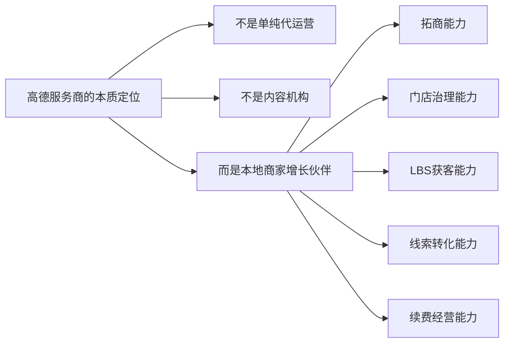

### 一句话结论

> 抖音强在“内容带交易”，美团强在“经营带交易”，高德更应该做“位置流量带线索与到店，再带动付费和续费”。

---

## 2. 平台对比总览

### 2.1 三个平台的服务商模式对比

| 平台 | 流量入口 | 用户决策方式 | 服务商核心角色 | 主要卖点 | 平台应重点开放 |
|---|---|---|---|---|---|
| 抖音本地生活 | 内容、直播、达人、推荐流 | 先种草，再下单 | 内容代运营、达人撮合、交易转化 | 帮商家做爆款内容和团购成交 | 内容、商品、直播、达人、交易、核销 |
| 美团本地生活 | 搜索、交易场、外卖/到店场景 | 明确消费需求，快速交易 | 经营代运营、门店增长顾问 | 帮商家提升线上经营效率和订单 | 店铺经营、投放、评价、履约、SaaS、数据 |
| 高德 | 搜索、地图、导航、附近推荐 | 强意图找店，到店决策 | 门店治理、LBS获客、线索转化服务商 | 帮商家提升被找到、被选择、被到店 | 门店、位置、曝光、线索、导航、到店归因 |

### 2.2 平台能力启发

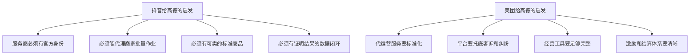

---

## 3. 高德服务商增长闭环

### 3.1 平台真正要打通的链路

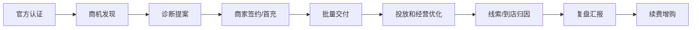

### 3.2 平台、服务商、商家的角色关系

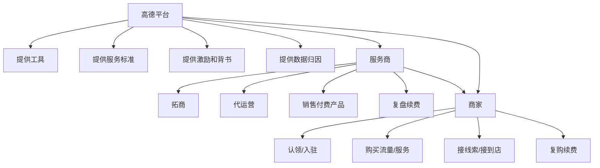

---

## 4. 高德该给服务商什么

### 4.1 五大能力板块

| 能力板块 | 平台要提供什么 | 解决服务商什么问题 | 对平台的商业价值 |
|---|---|---|---|
| 可信身份能力 | 认证、分级、验真、官方案例页 | 商家不信任、难成交 | 提升拓商转化率 |
| 批量作业能力 | 批量认领、批量编辑、连锁管理、授权协同 | 交付成本高、难规模化 | 提升拓店效率 |
| 销售转化能力 | 商机线索、诊断报告、报价系统、套餐配置 | 不会卖、不好讲价值 | 提升首单付费率 |
| 效果证明能力 | 曝光-线索-到店归因、月报、ROI工具 | 难证明效果、难续费 | 提升续费率和ARPU |
| 生态保障能力 | 培训、激励、客诉、仲裁、处罚 | 劣币驱逐良币 | 提升生态健康度 |

### 4.2 用流程看工具体系

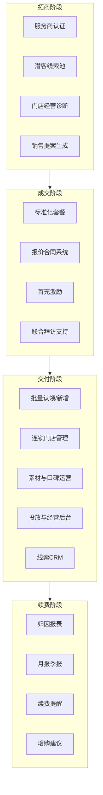

---

## 5. 重点不是“商家工具”，而是“服务商销售和交付工具”

### 5.1 平台最该优先建设的服务商工具

| 优先级 | 工具 | 为什么重要 | 直接影响 |
|---|---|---|---|
| P0 | 商机线索池 | 帮服务商知道该去找谁 | 拓商效率 |
| P0 | 门店经营诊断报告 | 帮服务商有理由说服商家 | 销售转化率 |
| P0 | 标准化套餐与报价系统 | 帮服务商把平台能力卖成商品 | 首单付费率 |
| P0 | 线索CRM | 帮服务商承接电话、留资、预约等线索 | 交付效果 |
| P0 | 归因报表 | 帮服务商证明结果 | 续费率 |
| P1 | 连锁批量经营后台 | 帮服务商服务大客户 | 客单价、规模化 |
| P1 | 评论口碑管理工具 | 帮服务商提升转化率 | 到店和付费效果 |
| P1 | 商圈和竞对分析 | 帮服务商讲清投放策略 | 高预算客户转化 |
| P2 | 联合营销和案例共建 | 帮头部服务商做大单 | 行业影响力 |

### 5.2 服务商需要的不是“后台”，而是“销售武器”

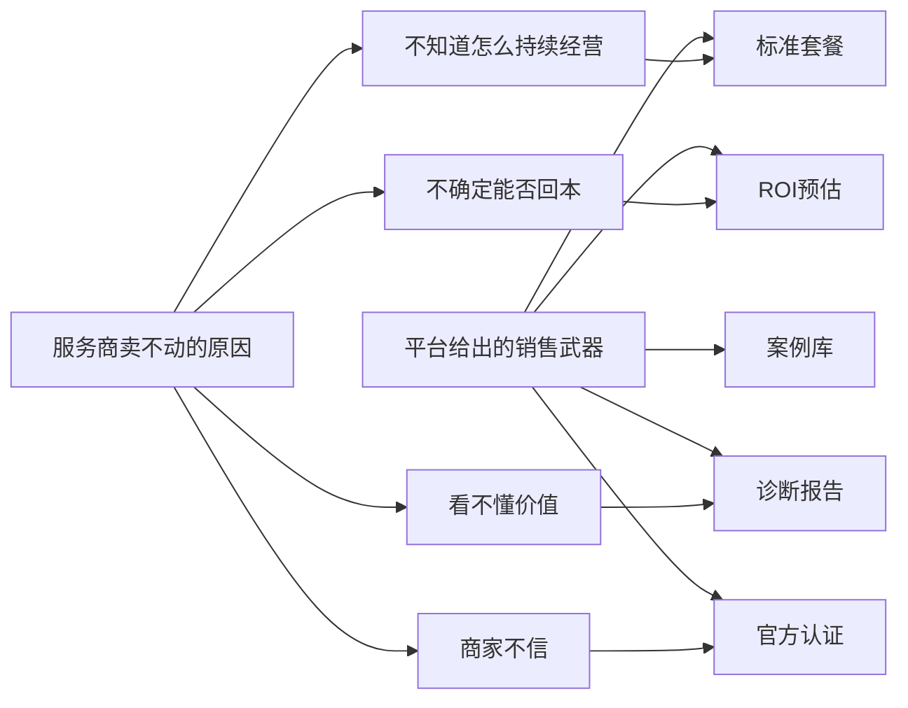

---

## 6. 高德服务商工具地图

### 6.1 按服务商经营流程拆解

| 服务商阶段 | 关键动作 | 平台提供的工具 | 备注 |
|---|---|---|---|
| 找客户 | 找潜在商家 | 潜客池、区域热力、未认领门店池、行业名单 | 高德独特价值明显 |
| 打销售 | 讲清楚为什么要上高德 | 门店诊断、竞对对比、ROI预估、案例库 | 决定成单率 |
| 促付费 | 把免费入驻转成购买 | 标准套餐、报价器、优惠券、首充补贴、返佣 | 决定商业化率 |
| 做交付 | 帮商家搭建和运营 | 批量认领、深度信息编辑、素材分发、评论管理 | 决定服务成本 |
| 做增长 | 帮商家拿更多线索/到店 | 投放后台、搜索词洞察、商圈分析、AB测试 | 决定效果上限 |
| 做复盘 | 证明效果并续费 | 归因报表、成交回传、月报、续费提醒 | 决定生命周期价值 |

### 6.2 工具全景图

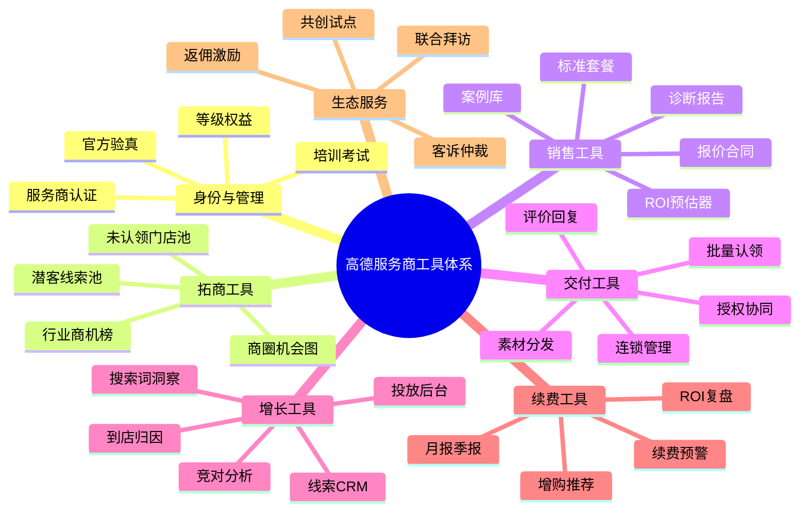

---

## 7. 平台除了工具，还必须给服务商哪些服务

### 7.1 服务体系设计

| 服务项 | 平台动作 | 作用 |
|---|---|---|
| 招募分层 | 区分拓店型、增长型、技术型、连锁KA型服务商 | 不同角色匹配不同能力 |
| 培训认证 | 做产品认证、行业认证、规则考试、案例复盘 | 提升专业度 |
| 等级权益 | 线索优先、返佣提升、试点名额、案例曝光 | 激励优质服务商 |
| 联合作战 | 平台BD与服务商联合拜访重点客户 | 提升大客户成交 |
| 结算激励 | 拓店奖、首充奖、续费奖、专项激励 | 提升拓商积极性 |
| 客诉仲裁 | 商家投诉、服务商申诉、违规处罚 | 保证生态健康 |

### 7.2 生态治理逻辑

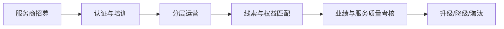

---

## 8. 从平台视角看，最值得优先做的 7 件事

### 8.1 P0 / P1 / P2 优先级

| 优先级 | 要做什么 | 原因 | 预期结果 |
|---|---|---|---|
| P0 | 服务商认证和验真体系 | 先解决商家信任问题 | 提高服务商拓商成功率 |
| P0 | 商机线索池 | 先解决服务商找谁卖 | 提高拓店效率 |
| P0 | 门店经营诊断报告 | 先解决怎么讲价值 | 提高首单付费率 |
| P0 | 标准化商品+报价器 | 先解决怎么卖 | 提高商业化效率 |
| P0 | 线索CRM+归因报表 | 先解决怎么证明效果 | 提高续费率 |
| P1 | 连锁经营后台 | 放大大客户价值 | 提升客单价 |
| P1 | 首充补贴+返佣激励 | 加快起量 | 提升投放渗透率 |
| P1 | 评论口碑和商圈洞察 | 提升交付结果 | 提高复购 |
| P2 | 联合营销和行业解决方案 | 打透重点行业 | 形成行业样板 |

---

## 9. 给汇报时可直接复用的结论页

### 9.1 适合放在PPT第一页的版本

> 高德服务商体系的目标，不是培养一批“帮商家认领门店的人”，而是培养一批“能帮平台拓商、帮商家成交、帮平台做商业化续费”的增长伙伴。

### 9.2 适合放在PPT末页的版本

> 高德最有机会做成的，不是抖音式内容服务商生态，也不是美团式深交易代运营生态，而是以地图、搜索、导航为核心的 LBS 商家增长服务商生态。平台要围绕“商机发现、销售转化、批量交付、线索归因、续费增购”五个环节建设完整能力。

---

## 10. 参考资料

- 高德商家免费入驻页面：https://wap.amap.com/activity/bgcmoney/Main.html
- 高德深度数据开放平台服务条款：https://a.amap.com/lbs/static/protocol/Deep_Data_Service_Terms.html
- 抖音开放平台-服务商平台概述：https://developer.open-douyin.com/docs/resource/zh-CN/thirdparty/overview/platform-intro/
- 抖音开放平台-生活服务商家应用概述：https://developer.open-douyin.com/docs/resource/zh-CN/local-life/introduction/overview
- 抖音开放平台-小程序生活服务代运营服务商接入指南：https://developer.open-douyin.com/docs/resource/zh-CN/mini-app/open-capacity/Industry/life/partner/partner-landing-guide
- 抖音开放平台-生活服务代运营服务商 CPS 接入指南：https://developer.open-douyin.com/docs/resource/zh-CN/mini-app/open-capacity/Industry/life/partner/CPS-guide
- 抖音开放平台-来客IM客服能力：https://developer.open-douyin.com/docs/resource/zh-CN/mini-app/open-capacity/operation/private-account/customer-service/douyin-laike-im-service
- 抖音开放平台-行业角色认证：https://developer.open-douyin.com/docs/resource/zh-CN/developer/join/Role
- 美团-外卖管家服务推出业内首个服务标准：https://www.meituan.com/news/NN231130060007660
- 美团-繁盛计划升级：数字化专项扶持餐饮商家：https://www.meituan.com/news/NN240905058008813
- 美团-2025年，商家提的问题，我们都改进了哪些？https://www.meituan.com/news/NN260206199002398
- 美团-继续坚持做餐饮行业的长效经营阵地：https://www.meituan.com/news/NN251017149001531
- 美团经营宝：https://e.meituan.com/mobile
- 美团客满满：https://k.meituan.com/

---

## 11. 抖音和美团对服务商的支持方式拆解

### 11.1 抖音更擅长提供什么支持

| 维度 | 抖音的典型支持方式 | 对服务商的价值 | 对高德的启发 |
|---|---|---|---|
| 官方身份 | 行业角色认证、服务商审核、服务商平台 | 服务商更容易建立官方信任感 | 高德也必须提供官方验真和能力标签 |
| 商家绑定 | 代运营合作关系、商家应用接入、权限链路 | 服务商可合法且稳定地代商家作业 | 高德需要标准授权和撤权机制 |
| 营销能力 | 内容、直播、达人、团购、私域、IM客服 | 服务商可直接推动交易转化 | 高德应强化搜索、导航、留资、预约能力 |
| 开放接口 | API、代开发、数据同步、CPS能力 | 服务商可规模化做SaaS和代运营后台 | 高德应提供门店、线索、报表、投放接口 |
| 案例和标准 | 行业接入指南、角色说明、规范体系 | 降低服务商学习成本 | 高德应做行业化打法模板 |

### 11.2 美团更擅长提供什么支持

| 维度 | 美团的典型支持方式 | 对服务商的价值 | 对高德的启发 |
|---|---|---|---|
| 服务标准 | 代运营服务标准、SLA、交付范围清晰 | 服务商更容易被商家理解和采购 | 高德应定义服务商标准化交付包 |
| 经营工具 | 经营宝、数据工具、选址和经营分析 | 服务商可卖“经营结果”而不是卖人力 | 高德应沉淀商圈、搜索、到店经营工具 |
| 平台托底 | 平台筛选服务商、商家投诉与售后机制 | 降低商家采购服务商的风险顾虑 | 高德要做客诉、仲裁和风控 |
| 资金政策 | 助力金、激励政策、账期优化等 | 提升商家首单尝试意愿 | 高德可做首充扶持和共投补贴 |
| 城市作战 | 城市团队、行业运营、地面支持 | 服务商更容易推进区域市场 | 高德可做城市和行业联合作战 |

### 11.3 适合高德借鉴的部分

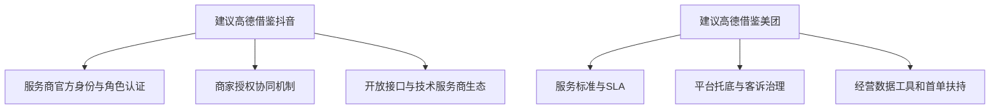

### 11.4 不建议高德照搬的部分

| 平台 | 不建议照搬的点 | 原因 |
|---|---|---|
| 抖音 | 过度围绕内容、达人、直播搭服务商体系 | 高德不是内容流量场，重心应是位置流量和到店决策 |
| 美团 | 过深地复制交易履约型经营模型 | 高德很多行业是线索和到店决策，不一定是平台内强交易闭环 |

---

## 12. 平台应给服务商提供的“工具+服务”组合包

### 12.1 平台能力不应只做工具，也要做成服务包

| 服务商阶段 | 平台提供的工具 | 平台提供的服务 | 共同作用 |
|---|---|---|---|
| 拓商 | 潜客池、诊断报告、案例库 | 官方背书、联合拜访、培训认证 | 帮服务商更容易签下商家 |
| 首单付费 | 套餐配置、报价器、补贴工具 | 首充激励、销售策略、行业方案 | 帮服务商提高付费渗透率 |
| 日常交付 | 批量作业、口碑管理、投放后台、CRM | 客服支持、规则培训、技术接入 | 帮服务商稳定交付效果 |
| 续费增购 | 归因报表、月报、预算提醒 | 客户成功策略、行业复盘、专项活动 | 帮服务商提高续费和ARPU |

### 12.2 建议平台提供的 12 项核心工具

| 编号 | 工具名称 | 服务对象 | 解决问题 |
|---|---|---|---|
| 1 | 服务商认证中心 | 服务商 | 解决身份可信问题 |
| 2 | 商机线索池 | 服务商 | 解决找客户难问题 |
| 3 | 门店经营诊断报告 | 服务商/商家 | 解决价值表达问题 |
| 4 | 行业案例库 | 服务商 | 解决销售说服问题 |
| 5 | 标准化套餐中心 | 服务商 | 解决产品难卖问题 |
| 6 | 报价合同系统 | 服务商 | 解决成交流程低效问题 |
| 7 | 批量认领与连锁后台 | 服务商 | 解决交付效率问题 |
| 8 | 素材与评价运营工具 | 服务商/商家 | 解决展示与口碑问题 |
| 9 | LBS投放工作台 | 服务商 | 解决流量获取问题 |
| 10 | 线索CRM | 服务商/商家 | 解决线索承接问题 |
| 11 | 曝光到到店归因报表 | 服务商/商家 | 解决效果证明问题 |
| 12 | 续费与增购提醒系统 | 服务商 | 解决客户经营问题 |

### 12.3 建议平台提供的 8 项核心服务

| 编号 | 服务名称 | 服务对象 | 目标 |
|---|---|---|---|
| 1 | 服务商招募与分层 | 服务商 | 建生态 |
| 2 | 产品培训与认证 | 服务商 | 提专业度 |
| 3 | 行业解决方案输出 | 服务商 | 提成交率 |
| 4 | 官方联合打单 | 服务商 | 拿下重点客户 |
| 5 | 首单扶持政策 | 服务商/商家 | 促进首次付费 |
| 6 | 客诉仲裁与风险治理 | 服务商/商家 | 建立平台信任 |
| 7 | 头部伙伴共创计划 | 服务商 | 打样板行业 |
| 8 | 周期性经营复盘 | 服务商 | 提升续费和增购 |

---

## 13. 高德可以卖给商家的，不应只是流量，而是“增长方案”

### 13.1 建议平台把商业产品打包成 4 类

| 产品包 | 包含内容 | 服务商怎么卖 | 商家为什么愿意买 |
|---|---|---|---|
| 基础经营包 | 认领、认证、资料完善、头图、营业信息、评论回复 | 先从低门槛切入 | 先把门店做完整，能被用户看到和信任 |
| 曝光增长包 | 搜索曝光、商圈曝光、品牌词、类目词、附近推荐 | 适合有获客焦虑的商家 | 解决“别人找不到我” |
| 转化增强包 | 电话留资、预约、活动页、到店权益、导航转化组件 | 适合强线索行业 | 解决“看到了但没转化” |
| 连锁经营包 | 总部门店管理、批量作业、区域投放、总部报表 | 适合品牌连锁和区域客户 | 解决“门店多、管理复杂、需要统一经营” |

### 13.2 从服务商视角看，最好卖的不是“流量”，而是以下三种结果

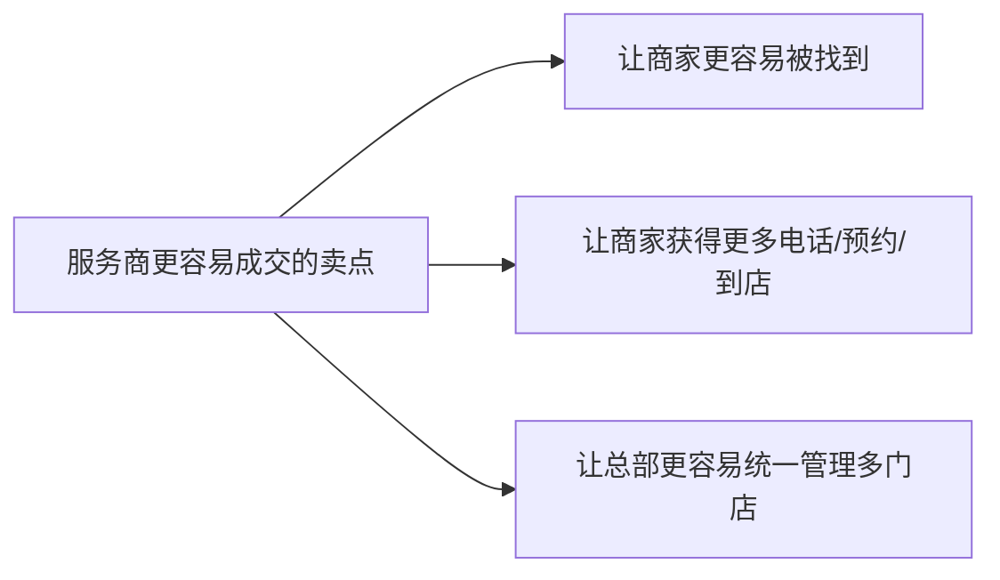

### 13.3 服务商销售时常见的商家顾虑

| 商家顾虑 | 平台应该提供什么能力帮助服务商成交 |
|---|---|
| 我已经在别的平台做了，为什么还要做高德 | 提供跨平台差异化价值说明，强调地图搜索和导航到店场景 |
| 我担心花钱没效果 | 提供 ROI 预估、试投补贴、归因报表 |
| 我没有人维护后台 | 提供授权代运营和服务商认证能力 |
| 我门店很多，管理太麻烦 | 提供连锁后台和总部视图 |
| 我怕被冒充官方的人骗 | 提供服务商官方验真和投诉入口 |

---

## 14. 高德内部可以如何定义服务商 KPI

### 14.1 如果要让服务商成为平台增长引擎，建议看四层指标

| 指标层级 | 核心指标 | 指标意义 |
|---|---|---|
| 生态规模 | 服务商数、活跃服务商数、认证通过率 | 看生态是否形成 |
| 拓商效率 | 拜访商家数、签约商家数、认领门店数、首充商家数 | 看服务商能否拉新 |
| 商业化效果 | 付费转化率、首充金额、ARPU、续费率、增购率 | 看服务商是否带动商业收入 |
| 服务质量 | 投诉率、流失率、交付时效、门店完整度提升、线索响应率 | 看生态是否健康 |

### 14.2 可作为季度目标的方向

| 方向 | 目标示例 |
|---|---|
| 提升服务商拓商效率 | 缩短从接触商家到签约的平均周期 |
| 提升商家首单付费率 | 提高认领商家转付费商家的比例 |
| 提升服务商交付质量 | 提高门店完整度和线索承接率 |
| 提升续费能力 | 提高付费商家 90 天和 180 天续费率 |

---

## 15. 最终建议

### 15.1 对平台策略的建议

1. 不要把高德服务商只定义为“代入驻外包”，要定义为“本地商家增长伙伴”。
2. 不要只建设商家后台，要优先建设服务商的销售和交付工具。
3. 不要只卖流量，要把高德能力打包成可理解、可销售、可复购的增长方案。
4. 不要只看首单，要从一开始就设计归因、续费和增购链路。
5. 不要让服务商单打独斗，平台要在认证、激励、联合打单、客诉仲裁上提供托底。

### 15.2 对产品建设顺序的建议

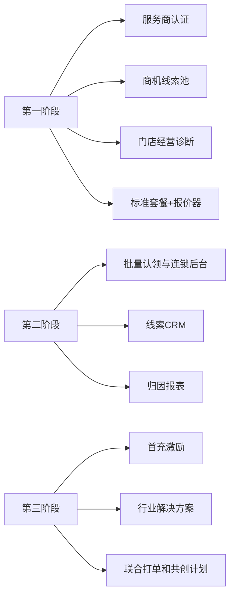

### 15.3 一句话收束

> 高德最值得建立的服务商体系，不是抖音式内容机构生态，也不是美团式深交易代运营生态，而是以地图、搜索、导航和线索归因为核心的 LBS 商家增长服务商生态。
